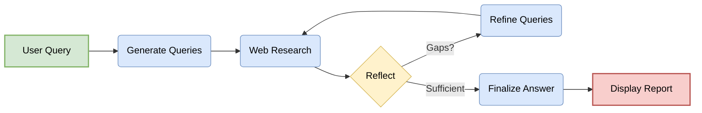

# Agent Black v3 - AI-Powered Research CLI

An advanced, CLI-based research agent that performs comprehensive, multi-step research on any topic. This tool is a powerful command-line adaptation of the original [gemini-fullstack-langgraph-quickstart](https://github.com/google-gemini/gemini-fullstack-langgraph-quickstart) project.

## How It Works

The core of this tool is a sophisticated agent built with LangGraph that intelligently navigates the web to find the best information. It doesn't just perform a single search; it reflects on its findings and launches new searches to fill in knowledge gaps, ensuring a comprehensive final report.



## Features

-   **🧠 Intelligent Agent**: Utilizes a LangGraph-powered agent for advanced, multi-step research.
-   **🔍 Dynamic Query Generation**: Uses Gemini to generate and refine search queries on the fly.
-   **🤔 Reflective Reasoning**: Analyzes search results to identify and fill knowledge gaps.
-   **📄 Rich, Formatted Output**: Presents findings in a beautiful and easy-to-read format in your terminal.
-   **📚 Cited Sources**: Generates a complete answer with citations from the gathered web sources.
-   **💾 Save for Later**: Allows you to save the complete report to a local text file.

## Technologies Used

-   **[LangGraph](https://python.langchain.com/docs/langgraph/)**: The core framework for building the stateful, multi-actor agent.
-   **[Google Gemini](https://deepmind.google/technologies/gemini/)**: The LLM used for query generation, reflection, and answer synthesis.
-   **[Rich](https://github.com/Textualize/rich)**: For beautiful and elegant terminal formatting.
-   **[Colorama](https://github.com/tartley/colorama)**: For cross-platform colored terminal text.

## Getting Started

Follow these steps to get the application running locally.

#### **1. Prerequisites:**

-   Python 3.9+
-   A Google Gemini API Key.

#### **2. Installation:**

First, clone the repository to your local machine:

```bash
git clone https://github.com/Leadersasif55/AgentBlack_Search_v3.git
cd AgentBlack_Search_v3
```

Next, it is highly recommended to create a Python virtual environment to manage dependencies:

```bash
python -m venv venv
source venv/bin/activate  # On Windows, use `venv\Scripts\activate`
```

Now, install the required packages:

```bash
pip install -r requirements.txt
```

#### **3. Configure Your API Key:**

Create a `.env` file in the project's root directory. You can do this by copying the `.env.example` file if one exists, or creating a new one. Add your Gemini API key to this file:

```
GEMINI_API_KEY="YOUR_ACTUAL_API_KEY"
```

You can get a Gemini API key from [Google AI Studio](https://aistudio.google.com/).

## Usage

You can run searches directly using `python main.py` or use the provided helper scripts.

#### **Command Line Arguments:**

-   `query`: (Required) The search topic, enclosed in quotes.
-   `--difficulty`: `easy`, `medium`, or `hard`. Controls the depth of research. (Default: `medium`).
-   `--model`: Specify a Gemini model to use.
-   `--save FILENAME`: Save the report to a text file.
-   `--no-color`: Disable all colored output.
-   `--retries N`: Set the max number of retries for API calls.

#### **Examples:**

**1. Basic search with medium difficulty:**
```bash
python main.py "The future of renewable energy"
```

**2. An in-depth search on a technical topic, saved to a file:**
```bash
python main.py "How do neural networks learn?" --difficulty hard --save neural_networks.txt
```

## License

This project is licensed under the Apache License 2.0. See the `LICENSE` file for details. 